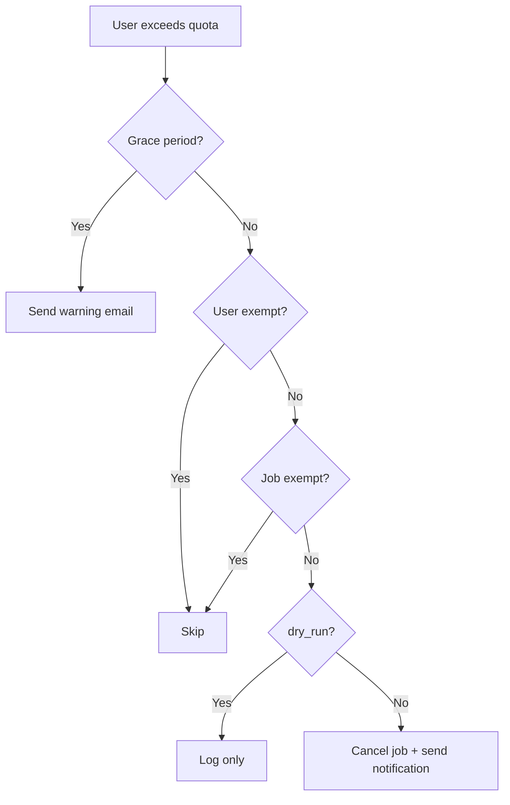

# monitor

Real-time monitoring with optional quota enforcement.

## Usage

```bash
slurmq monitor [OPTIONS]
```

## Options

| Option       | Short | Description                               |
| ------------ | ----- | ----------------------------------------- |
| `--interval` | `-i`  | Refresh interval in seconds (default: 30) |
| `--once`     |       | Single check, then exit (for cron)        |
| `--enforce`  |       | Enable quota enforcement                  |

## Examples

### Live dashboard

```bash
# Interactive monitoring with 30s refresh
slurmq monitor

# Faster refresh
slurmq monitor --interval 10
```

### Single check (for cron)

```bash
# Check once and exit
slurmq monitor --once

# With enforcement
slurmq monitor --once --enforce
```

## Enforcement

When `--enforce` is enabled, slurmq will cancel jobs for users who exceed their quota.

!!! warning "Enable in config first"
Enforcement must be enabled in your config file:

    ```toml
    [enforcement]
    enabled = true
    dry_run = true  # Start with dry_run to preview
    ```

### Enforcement behavior

1. **Grace period** - Users get a warning email before cancellation
2. **Cancel order** - Jobs cancelled in LIFO or FIFO order
3. **Exemptions** - Skip specific users or job prefixes
4. **Dry run** - Preview what would be cancelled

### Configuration

```toml
[enforcement]
enabled = true
dry_run = true              # Set false when ready
grace_period_hours = 24     # Warning window
cancel_order = "lifo"       # "lifo" or "fifo"
exempt_users = ["admin"]
exempt_job_prefixes = ["checkpoint_"]
```

### Enforcement flow



## Cron setup

Run monitoring every 5 minutes:

```bash
# /etc/cron.d/slurmq
*/5 * * * * root slurmq --quiet monitor --once --enforce >> /var/log/slurmq.log 2>&1
```

Or with systemd timer:

```ini
# /etc/systemd/system/slurmq-monitor.timer
[Unit]
Description=Run slurmq quota check

[Timer]
OnCalendar=*:0/5
Persistent=true

[Install]
WantedBy=timers.target
```

```ini
# /etc/systemd/system/slurmq-monitor.service
[Unit]
Description=slurmq quota monitoring

[Service]
Type=oneshot
ExecStart=/usr/local/bin/slurmq --quiet monitor --once --enforce
```

## Dashboard output

The live dashboard shows:

```console
┌─────────────────── slurmq monitor ───────────────────┐
│  Cluster: Della    QoS: normal    Refresh: 30s       │
├──────────────────────────────────────────────────────┤
│  User     Used      Remaining   Status   Active      │
│  alice    487.5     12.5        ! WARN   3           │
│  bob      342.0     158.0       ok       1           │
│  charlie  512.5     -12.5       x OVER   2 -> cancel │
├──────────────────────────────────────────────────────┤
│  Last check: 2024-01-15 14:30:00                     │
│  Press q to quit                                     │
└──────────────────────────────────────────────────────┘
```
